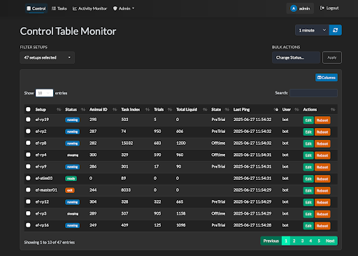
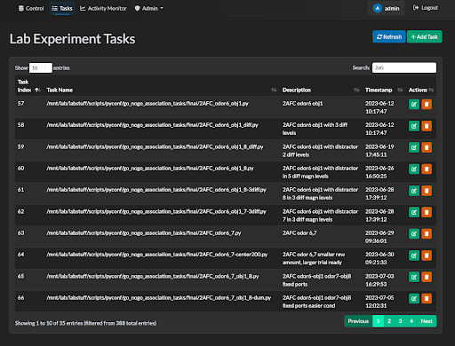
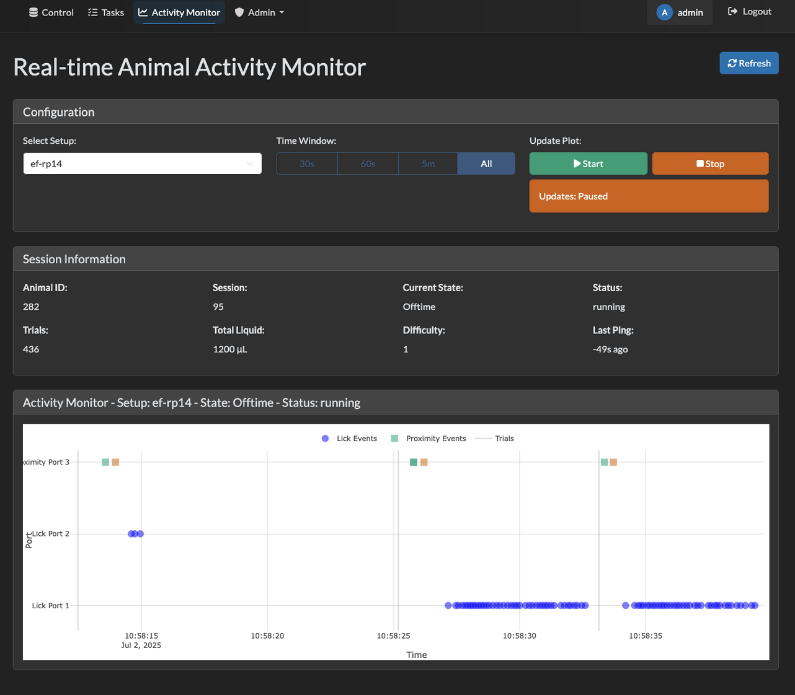

# Ethopy Control
[](https://ef-lab.github.io/ethopy_control/)
[](https://opensource.org/licenses/MIT)

A Flask-based application for managing laboratory experiments and device control.

👉 [Documentation](https://ef-lab.github.io/ethopy_control/)

## Quick Start

1. **Clone the repository:**
```bash
git clone github.com/ef-lab/ethopy_control
cd ethopy_control
```

2. **Create and activate virtual environment:**
```bash
python3 -m venv .venv
source .venv/bin/activate  # On Windows: .venv\Scripts\activate
```

3. **Install dependencies:**
```bash
# Using pip (standard installation)
pip install .
```

4. **Complete setup and database initialization:**
```bash
# Single command setup - handles environment and database setup
python3 app_setup.py
```

This interactive script will:
- **Create .env file** if it doesn't exist (prompts for database, SSH, and admin credentials)
- **Generate secure SECRET_KEY** automatically
- **Validate your configuration** and test database connectivity
- **Inspect your existing database structure**
- **Create the Users table** if it doesn't exist
- **Verify that required tables** (#control, #task) exist
- **Create an admin user** if no users exist
- **Provide detailed diagnostics** if any issues occur

**What you'll be prompted for:**
- Database credentials (host, username, password)
- SSH configuration (optional, for remote reboot functionality)
- Authentication preferences (local vs LDAP)
- Admin user configuration

**⚠️ Security Notes:**
- Never commit .env files to version control
- Store credentials securely (password manager recommended)

5. **Run the development server:**
```bash
python3 main.py
```

The application will be available at `http://localhost:5000`.

## Project Structure
```
ethopy_control/
├── main.py                   # Primary application entry point
├── app.py                    # Flask application definition and routes
├── app_setup.py             # Interactive setup with validation
├── models.py                # Database models (User, ControlTable, Task)
├── pyproject.toml          # Python project configuration and dependencies
│
├── utils/                   # Utility modules
│   ├── __init__.py         # Package initialization
│   ├── init_db.py          # Centralized database initialization
│   ├── config.py           # Configuration management and validation
│   └── setup_env.py        # Environment variable template generation
│
├── templates/              # Jinja2 HTML templates
│   ├── base.html          # Base template with navigation
│   ├── index.html         # Main control table interface
│   ├── login.html         # Authentication page
│   ├── tasks.html         # Task management interface
│   └── activity_monitor.html # Activity monitoring dashboard
│
├── static/                # Static web assets
│   ├── css/              # Stylesheets
│   ├── js/               # JavaScript files
│   │   └── table.js      # DataTables implementation
│   └── favicon.ico       # Site favicon
│
├── real_time_plot/        # Real-time data visualization
│   ├── get_activity.py    # Database activity queries
│   └── real_time_events.py # Dash-based real-time plotting
│
├── tests/                 # Test suite
│   ├── conftest.py       # pytest configuration
│   ├── test_api.py       # API endpoint tests
│   └── test_models.py    # Database model tests
│
└── docs/                 # Documentation
    ├── setup.md          # This setup guide
    └── mkdocs.yml        # Documentation configuration
```

## User Interface

### Control Table Interface


### Task Management Interface  


### Real-time Data Visualization


## Core Features

### 1. Control Table Management
- **Real-time status monitoring** of lab setups
- **Bulk operations** for updating multiple setups
- **User assignment** and access control
- **Remote reboot capability** via SSH

### 2. Task Management
- **CRUD operations** for experimental tasks
- **Task assignment** to specific setups
- **Task history** and tracking

### 3. Real-time Data Visualization
- **Live event plotting** using Dash and Plotly
- **Lick port and proximity sensor** data visualization
- **Configurable time windows** (30s, 60s, 5min, all)
- **Multi-setup monitoring**

### 4. User Management & Authentication
- **Local authentication**: Database-stored user accounts
- **Role-based access**: Admin and regular users
- **Session management** with Flask sessions

#### Documentation
```bash
# Build documentation
mkdocs build

# Serve documentation locally
mkdocs serve
```

### Package Management

This project uses modern Python packaging with `pyproject.toml`:

- **For users**: Use `pip install .`
- **For developers**: Use `pip install -e .[dev]`
- **For documentation**: Use `pip install -e .[docs]`
- **For testing only**: Use `pip install -e .[test]`

### Contributing

1. **Fork the repository**
2. **Create a feature branch**: `git checkout -b feature-name`
3. **Make your changes** following the code style guidelines
4. **Submit a pull request**

#### Code Style Guidelines

- Use **Ruff** for code formatting (line length: 88)
- Follow **PEP 8** naming conventions
- Add **type hints** for function parameters and return values
- Write **docstrings** for public functions and classes
- Keep **imports** organized (standard library, third-party, local)
- Use **pytest** for testing with descriptive test names

## 📚 Documentation

- **[Environment Variables](docs/environment-variables.md)** - Configuration guide
- **[Setup Guide](docs/setup.md)** - Installation instructions
- **[User Management](docs/user_management.md)** - Authentication setup

## Package Installation

### For End Users

```bash
# Clone the repository
git clone <repository-url>
cd ethopy_control

# Install using modern packaging
pip install .
```

### For Developers

```bash
# Clone the repository
git clone https://github.com/ef-lab/ethopy_control
cd ethopy_control

# Install in development mode with all tools
pip install -e .[dev]

# Or install with specific dependency groups
pip install -e .[test]     # Testing dependencies only
pip install -e .[docs]     # Documentation dependencies only
```

## 📄 License

This project is licensed under the MIT License - see the [LICENSE](LICENSE) file for details.