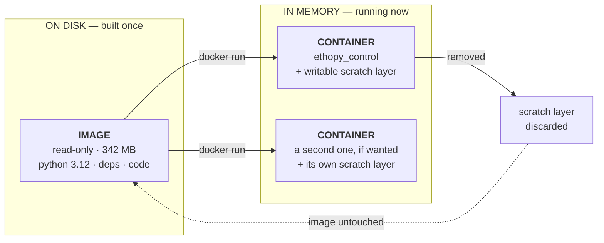
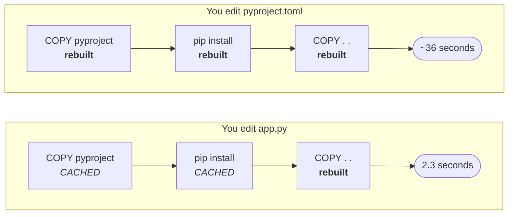
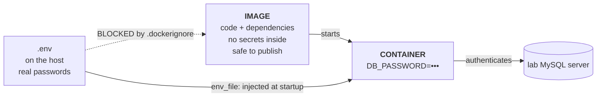
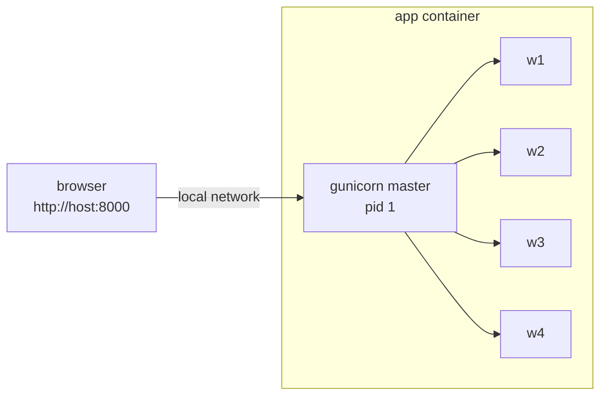
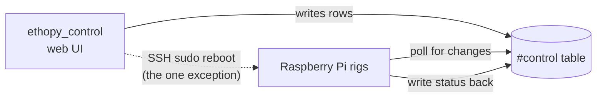

# How the Docker Deployment Works

This page explains **how** ethopy_control runs in Docker and why it is built the way it is. For **what to type** — deploying on a new machine, restarting, reading logs — see [DEPLOY.md](https://github.com/ef-lab/ethopy_control/blob/main/DEPLOY.md).

Every figure and measurement below was taken from a real running container, not from generic documentation.

---

## The one idea

Almost every Docker confusion comes from blurring two different things.

An **image** is a sealed, read-only snapshot of a filesystem — Python 3.12, the dependencies, and the application code, stacked and frozen. It does nothing. It just sits on disk.

A **container** is an ordinary Linux process running on the machine, which has been told "treat that snapshot as your entire filesystem, and don't look outside it."

That is genuinely most of it. A container is **not** a virtual machine — there is no second operating system booting, which is why ethopy_control goes from launched to serving traffic in about eight seconds. It is gunicorn, running as a normal process, with a restricted view of the world.



One image can start many containers, and each gets its own writable scratch layer on top. Anything a container writes there vanishes when it is removed.

!!! note "Why restarting is safe"
    `docker compose down` cannot lose data. The app stores nothing locally — all real data lives in the lab MySQL server. Only the disposable scratch layer is discarded.

---

## What is inside the image

The image is built in layers, one per instruction in the `Dockerfile`, each
storing only what changed. The real breakdown of the 342 MB:

| Layer | Contents | Size |
| --- | --- | ---: |
| `python:3.12-slim` | Debian + Python interpreter | 138 MB |
| `pip install ".[test]"` | flask · sqlalchemy · paramiko · ldap3 · dash · gunicorn | 197 MB |
| `COPY . .` | app.py · main.py · templates · static · utils | **0.33 MB** |
| `useradd appuser` | the non-root user | 0.34 MB |

The application code is roughly **0.1%** of the image. Everything else is the
runtime it needs. That lopsidedness drives the next section.

---

## Why dependencies are copied before the code

Docker caches every layer. On rebuild it walks the instructions from the top and reuses everything up to the first one whose inputs changed — then rebuilds that step **and everything after it**.

This is why the `Dockerfile` does something that looks redundant: it copies `pyproject.toml` on its own, installs dependencies, and only *then* copies the source.

```dockerfile
# 1. just the dependency list
COPY pyproject.toml README.md ./
RUN pip install --no-cache-dir ".[test]"   # the slow 197 MB step

# 2. then the code, which changes constantly
COPY . .
```

Because the code arrives *after* the install, editing `app.py` cannot invalidate the dependency layer. Docker reuses it and only redoes the 0.33 MB copy.



Measured on a real machine:

| Situation | Time |
| --- | ---: |
| First build, nothing cached | 36 s |
| After editing application code | **2.3 s** |
| After changing a dependency | ~36 s |

The cache breaks at the first changed instruction and stays broken for
everything below it — so the fast-changing things go last.

!!! tip "`README.md` is not decorative"
    It is copied alongside `pyproject.toml` because `pyproject.toml` declares `readme = "README.md"`. Without it, the build fails during metadata generation.

---

## How credentials get in without being in the image

This is the part most worth understanding, because it is what makes the image safe to publish on GitHub.

The image contains **no credentials**, and no lab hostnames either. `/app/.env` does not exist inside the running container. Yet the app knows the database host and password. Two mechanisms do that:

- **`.dockerignore`** lists `.env`, so the build never copies it *in*.
- **`docker-compose.yml`** has `env_file: .env`, which reads the file *on the host at startup* and injects the values as environment variables.



There is a neat consequence. Since `.env` is absent inside the container, this line in `utils/config.py` simply finds nothing:

```python
env_path = Path(".env")
if env_path.exists():          # False inside the container
    load_dotenv(dotenv_path=env_path)
```

So the injected environment variables are the single source of truth, with no second copy of the config to drift out of sync. The same image runs on a laptop and in the lab, only the injected values differ.

### Config is validated at import time

`utils/config.py` evaluates its required variables in the **class body**, so a missing value raises `ValueError` the moment the module is imported — the container dies on startup, not on the first request.

These five must always be present, even when unused:

`SECRET_KEY` · `DB_USER` · `DB_PASSWORD` · `SSH_USERNAME` · `SSH_PASSWORD`

This is why running the test suite in a container still needs dummy values passed with `-e`.

!!! danger "Never set `FLASK_ENV=development`"
    It is an authentication **bypass**, not a debug flag — `app.py:65-75` accepts *any* username and password when it is set. It is a different variable from `FLASK_CONFIG`, which makes it dangerously easy to set out of habit. `docker-compose.yml` deliberately leaves it unset.

---

## How a request reaches the app

The container has its own private IP on a Docker-managed network. Nothing outside the machine can reach that address directly. The `ports: "8000:8000"` line bridges the gap: Docker listens on the host's port 8000 and forwards to the container's port 8000.

Read the mapping as **host : container**. To serve on the normal web port instead, change only the left side to `"80:8000"` — the app inside still listens on 8000 and needs no reconfiguring.



**This is plain HTTP, with no HTTPS.** The stack ships that way on purpose: it
works on any lab network with no domain name and no certificates to renew. The
cost is that passwords cross the network readable, so it belongs on a trusted
local network only.

To publish it beyond the lab you put a reverse proxy in front, or reach it over
a VPN. Neither changes anything in this repository except two settings in
`.env`. See DEPLOY.md section 6.

Inside, gunicorn runs as a **master process supervising four workers**. The master does not handle requests; it supervises them. That distinction matters for recovery.

### What the container reaches out to

| Destination | Purpose |
| --- | --- |
| Lab MySQL server, port 3306 | Reads and writes `#control`, `#task` and activity tables |
| LDAP directory, port 389 | LDAP login |
| Raspberry Pi IPs, port 22 | SSH — the reboot button only |

Only port 8000 is published inbound. Everything else is **outbound**, which is why plain bridge networking works with no special configuration, and why the container needs no privileged access to control the rigs.

### The app does not drive the Pis

Worth stating explicitly, because it is the reason this containerizes so cleanly: the web app never controls the Raspberry Pis directly. The rigs poll the shared `#control` table and write their own state back. The web page just edits rows.



There are no serial ports, no GPIO, no `/dev` access, no `subprocess` calls and no host mounts anywhere in the codebase. The only direct device operation is the SSH reboot in `app.py:373-435`.

### Three database schemas

`real_time_plot/get_activity.py` opens engines at import time for three schemas on the same server:

- `lab_experiments` — configurable via `DB_NAME`
- `lab_behavior` — **hardcoded**
- `lab_interface` — **hardcoded**

The database user needs access to all three. The `#control` and `#task` tables must already exist; the app only ever creates the `users` table.

---

## What recovers what

"It restarts automatically" is really four different mechanisms handling four different failures. Knowing which is which saves debugging the wrong layer.

| Failure | Handled by | What you see | |
| --- | --- | --- | --- |
| A request hangs a worker | `gunicorn --timeout 60`<br/>*(the master, not Docker)* | Worker killed and replaced; site never drops | automatic |
| The app crashes outright | `restart: unless-stopped` | Container restarts within seconds | automatic |
| The machine reboots | Docker daemon at boot, then the restart policy | App is back before anyone logs in | automatic |
| Alive but wedged | `HEALTHCHECK` marks it unhealthy | `docker compose ps` shows `(unhealthy)` | **manual** |
| Lab database unreachable | Nothing, correctly | Errors in the logs; restarting will not help | **not Docker** |

!!! warning "Docker's restart policy does not react to health checks"
    A container can sit marked `unhealthy` indefinitely. In practice `--timeout` covers the realistic hang, because the failure mode is a stuck worker rather than a wedged master. The health check is a signal for a human, not an automatic fix.

`unless-stopped` is chosen over `always` deliberately: it still survives reboots, but respects a deliberate `docker compose stop` instead of fighting the
operator.

!!! danger "Do not test recovery with `docker kill`"
    Docker never restarts a container that a human stopped, and it counts `docker kill` and `docker stop` as human decisions. The container will sit there `Exited` and it looks like recovery is broken — it is not.

    To simulate a real crash, kill a worker **inside** the container:

    ```bash
    docker compose exec -u root web sh -c 'kill -9 7'
    docker compose logs --tail=5
    ```

    You should see `Worker (pid:7) was sent SIGKILL!` immediately followed by `Booting worker with pid: ...`, with no interruption to the site.

### Machine reboot needs one manual step

```bash
sudo systemctl enable docker
```

Without this the Docker daemon does not start at boot, and the restart policy never gets a chance to run. This is the single easiest thing to forget.

---

## Reading the commands

With the mental model in place, the commands stop being incantations.

| Command | What it really does |
| --- | --- |
| `docker compose up -d` | Start a container from the image; `-d` detaches it so it outlives your terminal |
| `docker compose down` | Stop and delete the container. The image stays. No data is lost. |
| `docker compose ps` | Is the process alive, and does the health check pass? |
| `docker compose logs -f` | Everything gunicorn wrote to stdout, streamed |
| `docker compose up -d --build` | Rebuild the image from the `Dockerfile`, then restart the container with it |
| `docker compose exec web sh` | Open a shell *inside* the running container |
| `docker compose build` | Turn the `Dockerfile` into a new image, using the layer cache |

Updating is `pull` then `up -d` precisely because they are separate steps: the first fetches the new image, the second notices the container is running an old one and replaces it.

### Looking inside a running container

This is the single most useful debugging habit. The container is just a process, so you can walk into it:

```bash
# what config did it actually get?
docker compose exec web sh -c 'echo $DB_HOST'

# can it reach the lab database from in there?
docker compose exec web python -c \
  "import socket,os; socket.create_connection((os.environ['DB_HOST'],3306),timeout=5); print('reachable')"

# run the built-in self-check
docker compose run --rm web python -m pytest -q
```

That last one is worth remembering. The tests use in-memory SQLite, so they prove the image is sound **without touching a database** — useful on a brand-new machine before trusting it with anything. Note that the required environment variables must still be present, because of the import-time validation described above.

---

## The files, and what each one is for

| File | Role |
| --- | --- |
| `Dockerfile` | How to build the image: base, dependencies, code, user, port, start command |
| `.dockerignore` | What must **not** enter the image — `.env` above all |
| `docker-compose.yml` | How to run it: image, credentials, port mapping, restart policy |
| `.env.example` | Template for the credentials; the real `.env` is gitignored |
| `DEPLOY.md` | The operator runbook |

### Why there is no image registry

Building the image leaves it in the Docker daemon's storage on **that machine only** — it is not a file in the project folder. So for a second computer to run it, one of three things has to happen:

1. **Rebuild from source there** (needs the repository) — what this project does
2. Export with `docker save`, move the tar, `docker load` (works offline, goes stale immediately)
3. Push to a registry and `docker pull` (the usual choice at scale)

An earlier version of this setup used option 3, publishing to GitHub Container Registry via a CI workflow. It was removed deliberately.

The selling point of a registry is that a new machine needs no source code. In practice that bought very little here: whoever deploys needs this repository anyway for `docker-compose.yml` and `.env.example`, and anyone changing the code needs it regardless. Meanwhile it added a CI pipeline and a package-visibility setting that would fail with an unhelpful *denied* — both things that can quietly break long after the person who set them up has gone.

For a one- or two-machine lab deployment, `git pull && docker compose up -d --build` is one mental model instead of two, and the layer cache makes a code-only rebuild take about two seconds.

---

## Design decisions worth knowing

**Single-stage build.** A multi-stage build would buy nothing here: every dependency is either pure Python (`pymysql`, `ldap3`) or ships prebuilt manylinux wheels (`cryptography`, `paramiko`). No compiler, no `build-essential`, no `gcc`, and no `mysql-client` are needed.

**Python 3.12.** The project declares `>=3.9`, older docs said 3.11, and the development virtualenv is 3.13. 3.12 is the safe middle ground; 3.9 is end-of-life.

**gunicorn, not `python main.py`.** `main.py` starts Flask's development server, which is single-threaded and not for production. Four **sync** workers are correct here because the app has no WebSockets or SSE — the live views are plain AJAX polling.

**`main:app` as the entry point.** This works because `main.py` does `from app import app` at module scope. Importing `main` does **not** execute `main()`, which deliberately skips its database pre-flight check — in a container it is better to start and serve errors than to refuse to boot and crash-loop during a brief database blip.

**Health check uses `urllib`, not `curl`.** `python:3.12-slim` does not ship `curl`. It targets `/login` rather than `/`, because `/` is behind `@login_required` and only issues a 302 redirect.

**Non-root user.** If the app is ever compromised, the attacker lands as an unprivileged user inside the container rather than as root.

**Plain HTTP, and no HTTPS service in this stack.** An earlier version bundled a Caddy container that obtained certificates automatically. It was removed deliberately. Bundling HTTPS forces every deployment to have a public domain name and a certificate to renew, which is the wrong default for a tool most labs will run on their own network. It also duplicated work that an existing reverse proxy on the network may already do for every other service. Serving HTTP and stopping there keeps this repository to one job, and leaves the choice of how to publish it to whoever deploys it. See DEPLOY.md section 6.

---

## Known issues

- **The reboot button does not currently work.** `SSH_USERNAME` and `SSH_PASSWORD` are placeholders, so it returns *"SSH credentials not   configured"* (`app.py:392`). Set real Raspberry Pi credentials in `.env` to enable it; the Pi must also allow `sudo reboot` without a password prompt.
- **The UI loads jQuery, Plotly, FontAwesome and Toastify from public CDNs.** On a fully air-gapped network the page loads but looks broken.
- **`real_time_plot/real_time_events.py`** is a separate Dash app on port 8050. It is never imported by `app.py` or `main.py` and is not part of the deployment.
- **`app_setup.py` cannot run in a container** — it is interactive. Inject environment variables instead.
