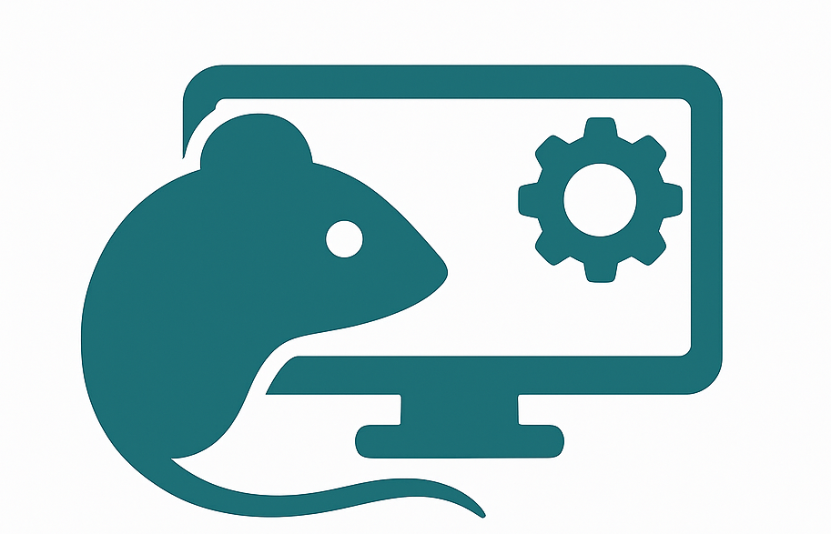

# Monitor Experiments

A Flask-based web interface for comprehensive monitoring and management for the experimental setups.

## Features

- Real-time status tracking for multiple experimental setups
- Advanced filtering and bulk status update capabilities
- Dynamic setup management with controlled status transitions
- Multiple authentication methods (Local and LDAP)
- User management with admin capabilities
- Active setup monitoring with visual indicators
- Remote reboot functionality via SSH
- Real-time activity monitoring with interactive plots

## Status Workflow

The application enforces a strict status transition workflow:

1. **Running flow**: ready -> running or sleeping -> running  (Normal from sleeping goes to running based on the start_time of the experiment)
2. **Stop flow**: running -> stop -> ready
3. **Exit flow**: any_status (raised error) -> exit

## Data Fields

The Control table contains the following important fields:

- `setup` (primary key): Hostname of the machine running the experiment
- `status`: Current setup status (ready/running/stop/exit)
- `last_ping`: Timestamp of the last status update
- `queue_size`: Number of pending operations
- `trials`: Current trial index in the session
- `total_liquid`: Total amount of reward delivered
- `state`: Current experiment execution state
- `task_idx`: Index of the task to be executed
- `animal_id`: Identifier for the test subject
- `ip`: IP address of the machine running the experiment (used for remote reboot)

## Automatic Updates

The Control table is automatically updated every 5 seconds by default.

## Documentation

- [Setup Guide](setup.md) - Installation and configuration
- [Environment Variables](environment-variables.md) - Configuration and deployment
- [User Management](user_management.md) - Managing users and authentication
- [Monitoring and Control](monitoring.md) - Monitoring setups and remote management
- [Activity Monitor](activity_monitor.md) - Real-time activity visualization
